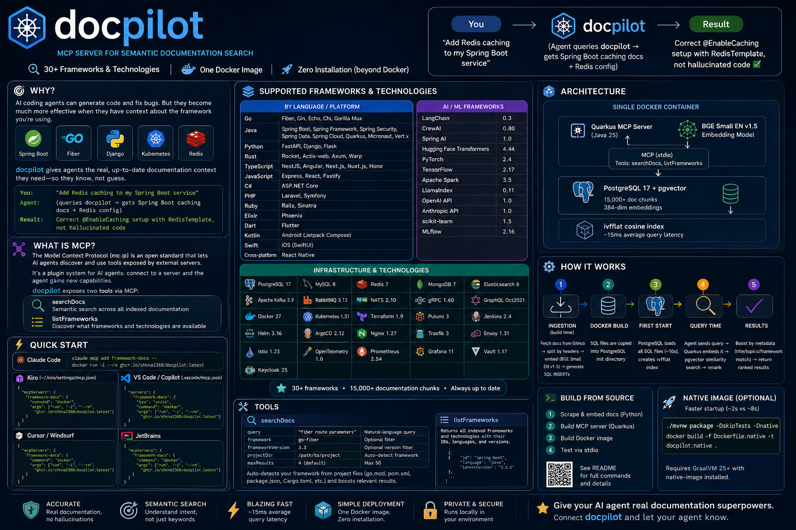
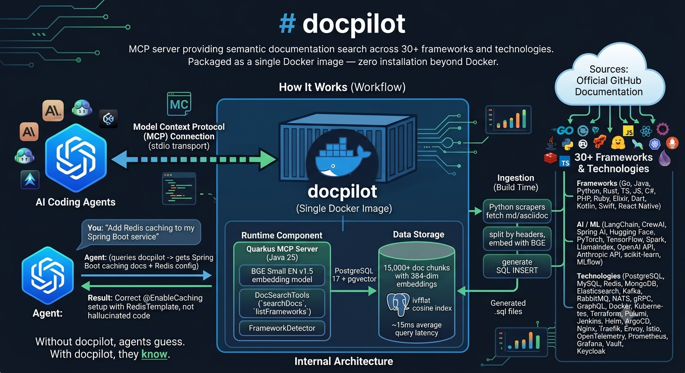

# Architecture





## Overview

docpilot runs as a single Docker container with two main components:

```
┌─────────────────────────────────────────────────┐
│  Docker Container                                │
│                                                  │
│  ┌───────────────────────────────────────────┐  │
│  │  Quarkus MCP Server (Java 25)             │  │
│  │  - stdio transport                        │  │
│  │  - BGE Small EN v1.5 embedding model      │  │
│  │  - searchDocs + listFrameworks tools      │  │
│  └─────────────────┬─────────────────────────┘  │
│                    │                             │
│  ┌─────────────────▼─────────────────────────┐  │
│  │  PostgreSQL 17 + pgvector                 │  │
│  │  - 15,000+ doc chunks                    │  │
│  │  - 384-dim embeddings                    │  │
│  │  - ivfflat cosine index (~15ms queries)  │  │
│  └───────────────────────────────────────────┘  │
└─────────────────────────────────────────────────┘
```

## Query Flow

1. AI agent sends a natural-language query via MCP
2. Quarkus embeds the query using BGE Small EN v1.5
3. pgvector performs cosine similarity search (top 50 candidates)
4. Results are reranked with metadata boosting (title, topics, framework match)
5. Top N results returned to the agent

## Ingestion Pipeline (Build Time)

```
GitHub Repos → Python Scraper → Header-aware Chunking → BGE Embedding → SQL INSERT files
```

1. **Scrape**: Fetch markdown/asciidoc from GitHub repos
2. **Chunk**: Split by headers with recursive fallback (max ~1500 chars)
3. **Embed**: Generate 384-dim vectors with BGE Small EN v1.5
4. **Write**: Output as SQL INSERT statements

## Project Structure

```
docpilot/
├── pom.xml                          # Quarkus + langchain4j + MCP
├── Dockerfile
├── docker/
│   ├── entrypoint.sh                # Starts PG then Java server
│   ├── init.sql                     # Schema (pgvector)
│   └── zz-index.sql                 # ivfflat index
├── src/main/java/io/frameworkdocs/mcp/
│   ├── DocSearchTools.java          # MCP tool definitions
│   ├── FrameworkDetector.java       # Auto-detect from project files
│   ├── EmbeddingModelLoader.java    # BGE model loader
│   ├── ContainerManager.java        # PgVector connection
│   ├── SqlLoader.java               # Schema readiness
│   └── StartupObserver.java         # Warm-up
└── ingestion/
    ├── src/
    │   ├── cli.py                   # CLI commands
    │   ├── scraper.py               # BaseScraper + DocPage
    │   ├── chunker.py               # Header-aware splitting
    │   ├── embedder.py              # BGE embeddings
    │   ├── sql_writer.py            # SQL generation
    │   └── scrapers/                # One per framework
    └── output/                      # Generated .sql files
```
